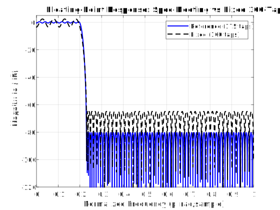
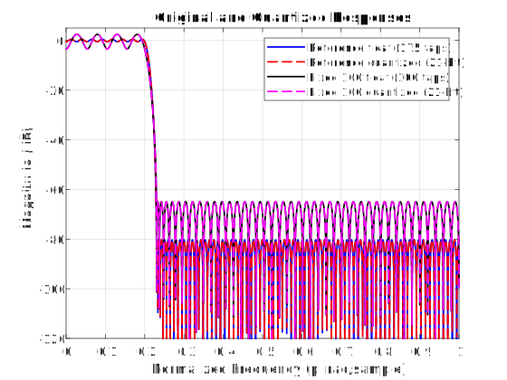

# FIR Filter Design and Implementation Project

## Project Overview
Low-pass FIR filter design and hardware implementation using MATLAB and Verilog.

**Due Date:** March 24th, 2026

## Project Requirements
- **Filter Type:** Low-pass FIR filter
- **Taps:** Minimum 100 taps
- **Transition Region:** 0.2π to 0.23π rad/sample
- **Stopband Attenuation:** ≥ 80 dB
- **Hardware Design Considerations:**
  - Pipelining
  - Reduced-complexity parallel processing (L=2, L=3)
  - Combined pipelining and L=3 parallel processing

## Repository Structure
```
.
├── matlab/                 # MATLAB filter design files
├── verilog/               # Verilog hardware implementation
├── verilog/testbench/     # Simulation testbenches
├── docs/                  # Documentation files
├── results/               # Hardware synthesis results
└── README.md
```

## MATLAB Design & Verilog Architecture Description
For the FIR design, the specs were given to us in the project, I can put those specs into 
d = fdesign.lowpass('Fp,Fst,Ap,Ast', Fpass, Fstop, Apass, Astop);

and MATLAB creates a filter with those specs. 

Park-McClellan design with weighted error to meet specs as closely as possible
Stop band dominant, not good for audio.



The atlab code exports my quantized integers into a hex file that I am able to import into verilog. 

Verilog code I have a main base code, and a number of wrappers that change parameters so I can generate all my varients of the filter. 

The FIR filter in verilog uses shift registers to maintain a sliding window of input samples. 

the MAC baseline is serialized and runs in a single clock cycle. 

Overflow handling is only done at the output stage if necesssary, internally the width is wide enough to prevent handling that step at every MAC, which would tank performance while making the chip larger. (tried it once and it could only run at 1MHz)

## Filter Analysis



### Quantization Sweep (10 to 24 bits)

| Bits | Ref Stop (dB) | Ref Ripple (dB) | 100-tap Stop (dB) | 100-tap Ripple (dB) |
|---:|---:|---:|---:|---:|
| 10 | 49.55 | 0.9809 | 47.34 | 5.8910 |
| 11 | 51.46 | 0.9879 | 55.50 | 5.8858 |
| 12 | 59.56 | 0.9733 | 57.09 | 5.8748 |
| 13 | 64.71 | 0.9689 | 61.62 | 5.8703 |
| 14 | 67.25 | 0.9672 | 62.53 | 5.8706 |
| 15 | 73.70 | 0.9662 | 63.49 | 5.8696 |
| 16 | 77.18 | 0.9656 | 64.41 | 5.8698 |
| 17 | 77.67 | 0.9657 | 64.68 | 5.8699 |
| 18 | 79.21 | 0.9657 | 64.79 | 5.8697 |
| 19 | 79.74 | 0.9657 | 64.86 | 5.8696 |
| 20 | 79.92 | 0.9657 | 64.83 | 5.8697 |
| 21 | 80.02 | 0.9657 | 64.80 | 5.8697 |
| 22 | 80.01 | 0.9657 | 64.80 | 5.8697 |
| 23 | 80.05 | 0.9657 | 64.80 | 5.8696 |
| 24 | 80.05 | 0.9657 | 64.81 | 5.8696 |

Reference filter minimum bits meeting 80.0 dB stopband: 21

Fixed-100 filter does not meet 80.0 dB stopband in 10-20 bits.

=== Summary ===

Reference filter: 175 taps with 21-bit quantized coefficients

Fixed-100 filter: 100 taps with floating-point coefficients

Input bits: 16 | Output bits: 32

Reference float: passband ripple = 0.966 dB, stopband attn = 80.05 dB

Reference quant (21-bit): stopband attn = 80.02 dB

Fixed-100 float: passband ripple = 5.870 dB, stopband attn = 64.80 dB


3. **Architecture Documentation** - Pipelined and/or parallelized FIR filter design
4. **Hardware Implementation Results** - Area, clock frequency, power estimation
5. **Analysis & Conclusion** - Further analysis and project conclusions

## Report Sections Checklist (Course Rubric)

1. MATLAB design flow and Verilog structure
- FIR design method and specs: transition band, attenuation target, tap count choice.
- Coefficient generation and export flow to RTL.
- Verilog module structure and wrapper tops for each architecture.

2. Frequency response and quantization analysis
- Original (floating-point) vs quantized frequency response plots.
- Passband ripple and stopband attenuation values.
- Quantization sweep summary (bit width vs attenuation/ripple).
- Overflow handling strategy: saturating fixed-point accumulation in RTL.

3. Architecture description
- Baseline serial FIR.
- Serial pipelined FIR (two-stage partial-sum pipeline).
- Reduced-complexity parallel FIR (L=2 and L=3).
- Combined L=3 + pipelining configuration.

4. Hardware implementation results
- Area: logic elements, registers, DSP usage.
- Performance: setup slack, derived Fmax or achieved Fmax.
- Power: total/core dynamic/core static with confidence notes.

5. Analysis and conclusion
- Tradeoff discussion across architectures (PPA and accuracy).
- Why the selected implementation is best for the target.
- Limitations and future improvements.

## Design Status
- [ ] MATLAB filter design complete
- [ ] Quantization analysis complete
- [ ] Verilog RTL implementation complete
- [ ] Testbench and simulation complete
- [ ] Synthesis and timing analysis complete
- [ ] Documentation complete

## Architecture Comparison Summary

Use this table to summarize functional and hardware results for each required architecture.

| Variant | Top Entity | Taps | Coeff Format | Pipeline | Parallel Factor | Logic Elements | Registers | DSP (9-bit) | Fmax (MHz) | Power (mW) | Status |
|---|---|---:|---|---|---:|---:|---:|---:|---:|---:|---|
| Baseline | fir_top_baseline | 175 | 21-bit fixed | No | 1 | 26,613 | 2,846 | 0 | 34.4 (derived) | 141.68 | Implemented, compiled (no retiming, default optimization) |
| Baseline (32-bit coeff fixed) | fir_top_baseline_fixed32 | 175 | 32-bit fixed | No | 1 | 31,294 | 2,857 | 228 | 34.1 (derived) | 145.70 | Implemented, compiled |
| Pipelined (serial) | fir_top_pipeline | 175 | 21-bit fixed | Yes (2-stage partial-sum pipeline) | 1 | 29,866 | 13,899 | 0 | 73.1 (derived) | 157.31 | Implemented, compiled (retiming ON, staged reduction) |
| Parallel L=2 | fir_top_l2 | 175 | 21-bit fixed | No | 2 | 26,699 | 2,846 | 0 | 37.1 (derived) | 139.02 | Implemented, compiled ? |
| Parallel L=3 | fir_top_l3 | 175 | 21-bit fixed | No | 3 | 26,743 | 2,846 | 0 | 34.3 (derived) | 141.25 | Implemented, compiled ?|
| Parallel L=3 + pipeline | fir_top_l3_pipeline | 175 | 21-bit fixed | Yes (1 stage) | 3 | 30,346 | 15,268 | 0 | 69.1 (derived) | 158.55 | Implemented, compiled (retiming ON, staged reduction RTL) |
| Reduced-complexity 100-tap (quantized) | fir_top_100_quantized | 100 | 21-bit fixed | No | 1 | 16,181 | 1,645 | 0 | 41.5 (derived) | 129.14 | Implemented, compiled |
| Reduced-complexity 100-tap (32-bit coeff fixed) | fir_top_100_fixed32 | 100 | 32-bit fixed | No | 1 | 13,670 | 1,656 | 280 | 41.3 (derived) | 135.66 | Implemented, compiled |
| Deep Pipelined (serial) | fir_top_pipeline_deep | 175 | 21-bit fixed | Yes (deeper than 2-stage) | 1 | 28,993 | 12,340 | 0 | 79.9 (derived) | 157.38 | Implemented, compiled (retiming ON, staged reduction RTL) |
| Deep Parallel L=3 + pipeline | fir_top_l3_pipeline_deep | 175 | 21-bit fixed | Yes (deeper than 1-stage) | 3 | 30,292 | 13,855 | 0 | 76.6 (derived) | 158.40 | Implemented, compiled (retiming ON, staged reduction RTL) |

### Notes for Hardware Metrics
- Hardware metrics (logic elements, registers, DSP, Fmax, power) come from Quartus reports per top entity compile.
- Fmax and power values are derived from timing analysis (WNS) and power analyzer reports.
- Baseline timing source (no retiming, default optimization): WNS = -19.068 ns at 10 ns constraint, giving derived Fmax about 34.4 MHz.
- Baseline power source (no retiming, default optimization): Total Thermal Power = 141.68 mW with Low confidence (insufficient toggle rate data).
- Baseline fixed32 timing source: WNS = -19.301 ns at 10 ns constraint, giving derived Fmax about 34.1 MHz.
- Baseline fixed32 power source: Total Thermal Power = 145.70 mW with Low confidence (insufficient toggle rate data).
- Pipeline timing source (retiming ON, staged reduction): WNS = -3.676 ns at 10 ns constraint, giving derived Fmax about 73.1 MHz.
- Pipeline power source (retiming ON, staged reduction): Total Thermal Power = 157.31 mW with Low confidence (insufficient toggle rate data).
- L2 timing source: WNS = -16.919 ns at 10 ns constraint, giving derived Fmax about 37.1 MHz.
- L2 power source: Total Thermal Power = 139.02 mW with Low confidence (insufficient toggle rate data).
- L3 timing source: WNS = -19.181 ns at 10 ns constraint, giving derived Fmax about 34.3 MHz.
- L3 power source: Total Thermal Power = 141.25 mW with Low confidence (insufficient toggle rate data).
- L3+pipeline timing source (retiming ON, staged reduction RTL): WNS = -4.462 ns at 10 ns constraint, giving derived Fmax about 69.1 MHz.
- L3+pipeline power source (retiming ON, staged reduction RTL): Total Thermal Power = 158.55 mW with Low confidence (insufficient toggle rate data).
- Deep serial timing source (retiming ON, staged reduction RTL): WNS = -2.511 ns at 10 ns constraint, giving derived Fmax about 79.9 MHz.
- Deep serial power source (retiming ON, staged reduction RTL): Total Thermal Power = 157.38 mW with Low confidence (insufficient toggle rate data).
- Deep L3+pipeline timing source (retiming ON, staged reduction RTL): WNS = -3.057 ns at 10 ns constraint, giving derived Fmax about 76.6 MHz.
- Deep L3+pipeline power source (retiming ON, staged reduction RTL): Total Thermal Power = 158.40 mW with Low confidence (insufficient toggle rate data).
- 100-tap (21-bit fixed) timing source: WNS = -14.117 ns at 10 ns constraint, giving derived Fmax about 41.5 MHz.
- 100-tap (21-bit fixed) power source: Total Thermal Power = 129.14 mW with Low confidence (insufficient toggle rate data).
- 100-tap fixed32 timing source: WNS = -14.231 ns at 10 ns constraint, giving derived Fmax about 41.3 MHz.
- 100-tap fixed32 power source: Total Thermal Power = 135.66 mW with Low confidence (insufficient toggle rate data).
